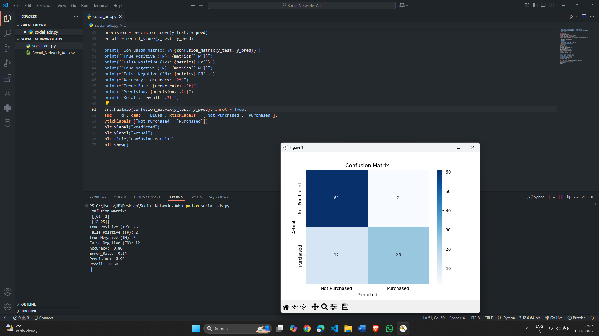

# Social-Network-Ads
Data Analytics II 1. Implement logistic regression using Python to perform classification on  Social_Network_Ads.csv dataset. 2. Compute Confusion matrix to find TP, FP, TN, FN, Accuracy, Error rate, Precision, Recall  on the given dataset. 

# Output

